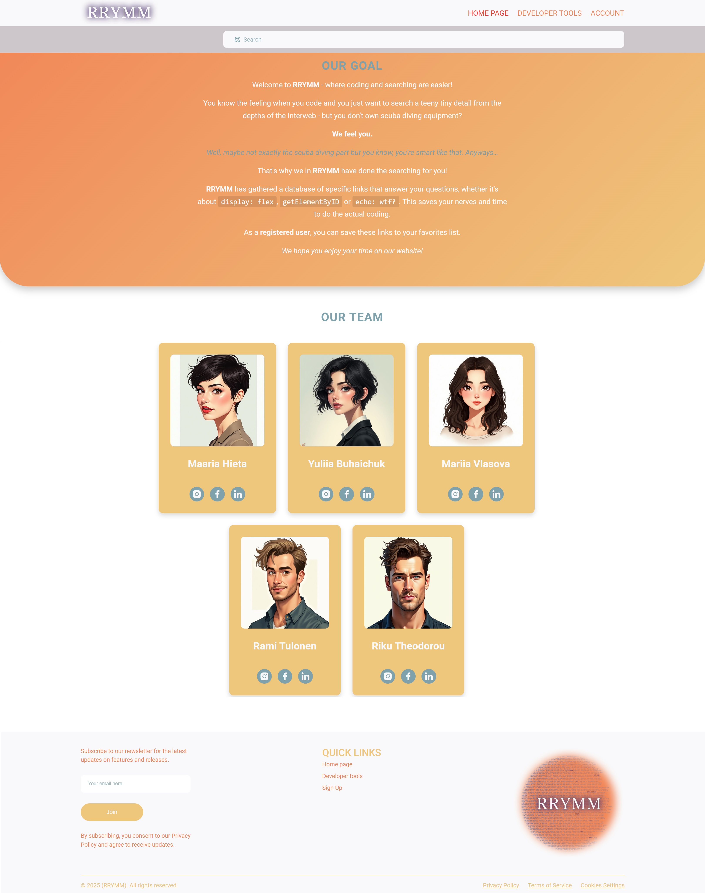
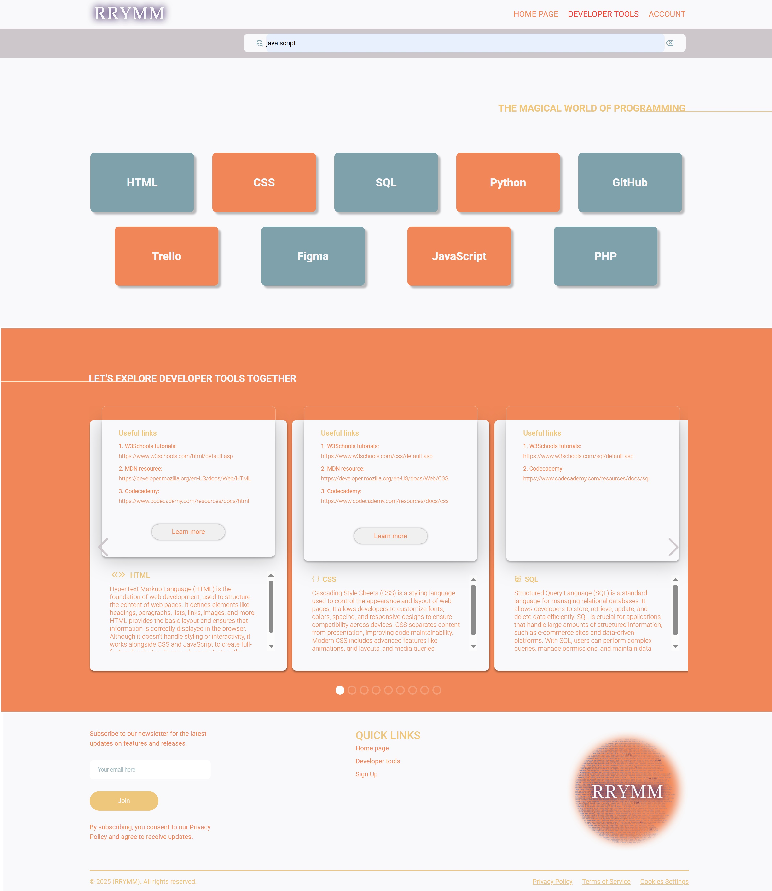
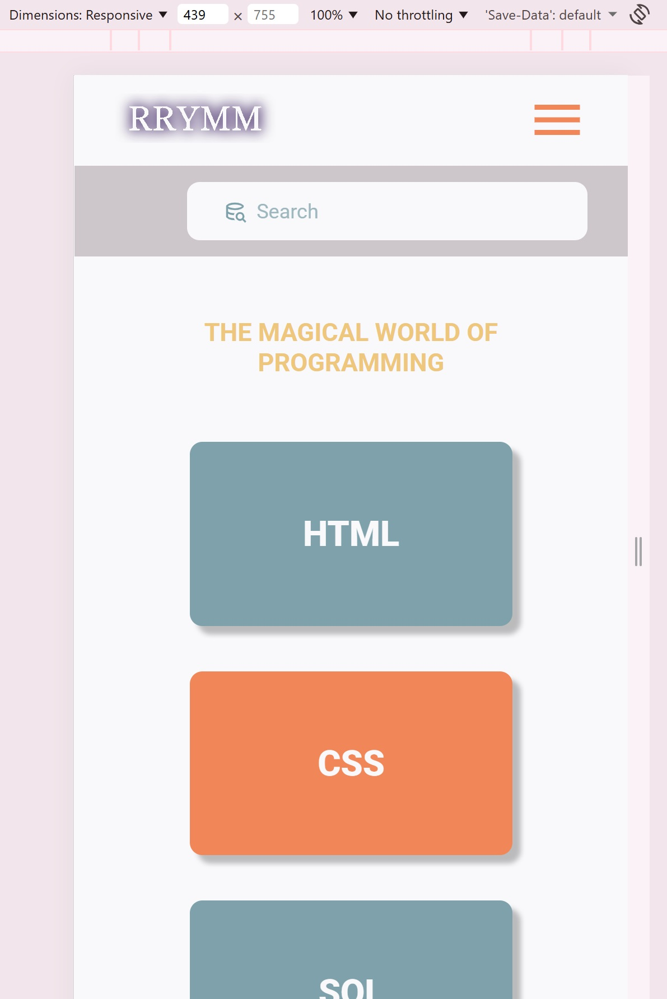
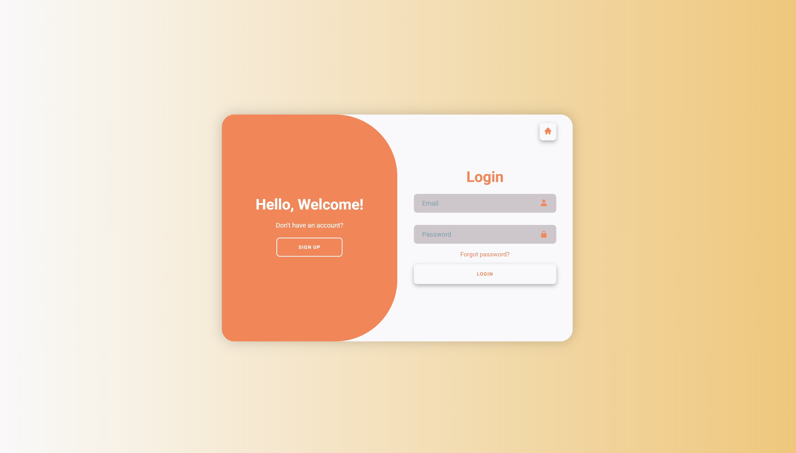
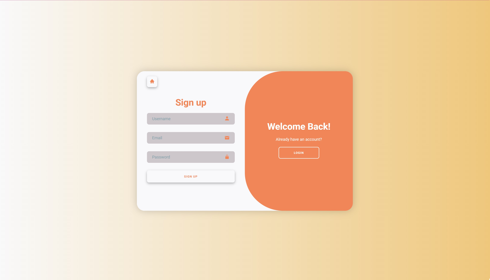

## RRYMM - team learning project

**RRYMM** was my first team project at the very beginning of my studies. The goal of the project was to create a simple website concept for beginners who want to learn programming, where useful learning resources (such as documentation and tutorials) could be collected in one place.

The project was created by a team of five students. During the project we were learning basic teamwork practices, GitHub collaboration, and UI design tools for the first time, so the development process progressed slowly and included multiple redesign iterations.

The final prototype included three main pages:

* Home
* Developer Tools
* Account

The project focused only on frontend implementation. There was no backend, database, or real authentication functionality — login and account features were visual prototypes only.

The project repository was managed on GitHub.

### My role: Frontend developer & project support

My responsibilities included:

* Creating a detailed step-by-step internal guide for the team on how to use GitHub, including Pull Requests and Issues
* Preparing a basic Product Description document with colors, typography, spacing, and UI guidelines
* Creating and improving the website layout based on the Figma prototype
* Redesigning UI elements to achieve better scalability after initial sizing issues
* Implementing the **Developer Tools** page structure dynamically using JavaScript (data generated from static variables)
* Designing responsive layouts, including a hamburger navigation menu
* Implementing the search field UI with interactive behavior (clear icon, input states)
* Preparing icons and visual assets for the pages
* Designing a simple project logo in Figma (globe concept with programming languages and development tools)

## Screenshots

### Home page

### Developer tools page

### Developer tools page: mobile version

### Login page

### Signup page

## LOGO

## Notes
Since this was the first team project, the main focus was on learning collaboration and development fundamentals rather than production-level architecture.
